Flow chart for Loading a page containing HTLM, CSS, JavaScript, json

Flow chart using POST method to update on the server

```mermaid
sequenceDiagram
    participant browser
    participant server

    browser->>server: POST https://studies.cs.helsinki.fi/exampleapp/new_note
    activate server
    browser-->>server: HTML document
    deactivate server

    browser->>server: REDIRECT https://studies.cs.helsinki.fi/exampleapp/notes
    activate server
    server-->>browser: Notes
    deactivate server

    browser->>server: GET https://studies.cs.helsinki.fi/exampleapp/main.css
    activate server
    server-->>browser: CSS file
    deactivate server

    browser->>server: GET https://studies.cs.helsinki.fi/exampleapp/main.js
    activate server
    server-->>browser: JavaScript file
    deactivate server

    Note right of browser: The browser starts executing the JavaScript code that fetches the JSON from the server

    browser->>server: GET https://studies.cs.helsinki.fi/exampleapp/data.json
    activate server
    server-->>browser: [{content: "Notes reset", date: "2024-11-20T14:35:57.836Z"},…]
    deactivate server

    Note right of browser: The browser executes the callback function that renders the notes
```

Flow chart for Loading a Single Page App (SPA)

Flow chart using POST to update on the server for a Single Page App (SPA)

